# Deploy de WordPress com Docker, AWS RDS e AWS EFS

Configuração de site WordPress dockerizado de forma automatizada com utilização de serviços AWS

---

### Objetivos

1. instalação e configuração do DOCKER ou CONTAINERD no host EC2;
2. Efetuar Deploy de uma aplicação Wordpress com container de aplicação RDS database Mysql;
3. configuração da utilização do serviço EFS AWS para estáticos do container de aplicação Wordpress;
4. configuração do serviço de Load Balancer AWS para a aplicação Wordpress;

#### Pontos Importantes

* não utilizar ip público para saída do serviços WordPress (Evitem publicar o serviço WP via IP Público)
* sugestão para o tráfego de internet sair pelo LB (Load Balancer Classic)
* pastas públicas e estáticos do wordpress sugestão de utilizar o EFS (Elastic File Sistem)
* Aplicação Wordpress precisa estar rodando na porta 80 ou 8080;

#### Tecnologias utilizadas

* Amazon EC2 
* Amazon VPC
* Amazon RDS
* Amazon EFS
* Docker

    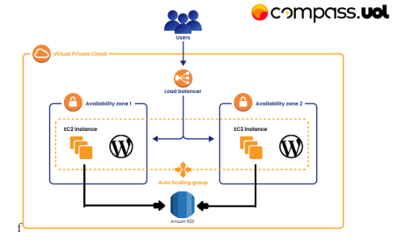
    
<em>Arquitetura do serviço</em>

---

### Criando VPC

Primeiro irei criar a VPC onde irá ficar todos os serviços.

    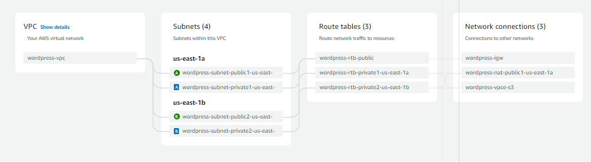
    
<em>Arquitetura do VPC</em>

* Foi colocado NAT gateway na VPC para que a instância em uma subnet privada possa acessar a internet, porém não o inverso.

---

### Criando Security Group

Agora irei criar o Security Group para a instancia, EFS, RDS e Load Balancer.

    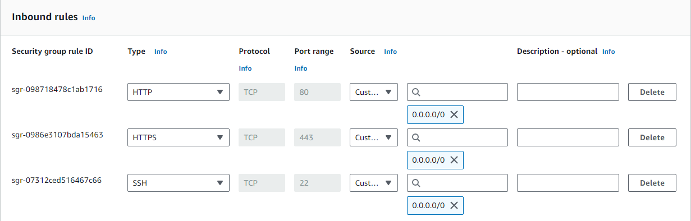
    
<em>Security Group do EC2</em>

    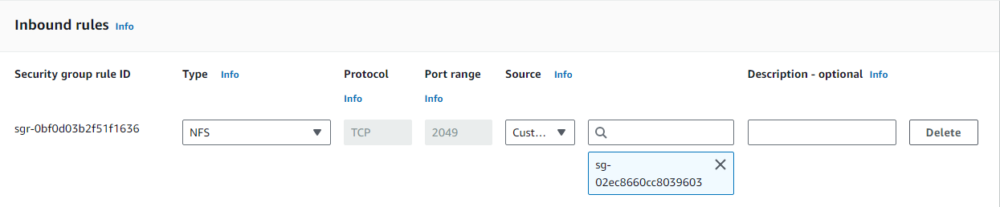
    
<em>Security Group do EFS</em>

    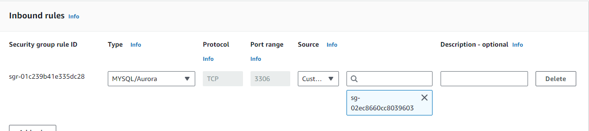
    
<em>Security Group do RDS</em>

    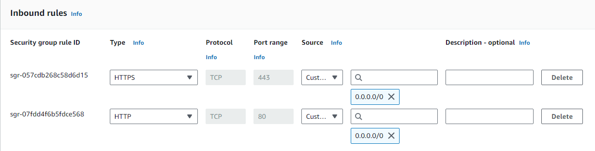
    
<em>Security Group do Load Balancer</em>

---

### Criando EC2 Connect Endpoint

Depois vamos criar um EC2 Connect Endpoint para que possamos conectar nas instancias privadas.
* Adicione o VPC no endpoint
* Coloque alguma Subnet da VPC
* Coloque o mesmo Security Group do EC2

À primeira vista não precisaremos utilizar o Endpoint, pois não precisaremos conectar na instância para configurá-la, mas foi criado caso precise.

---

### Criando Elastic File System (EFS)

Para a criação do EFS basta ir até o serviço no portal AWS e localizar onde está escrito "Create file System".

    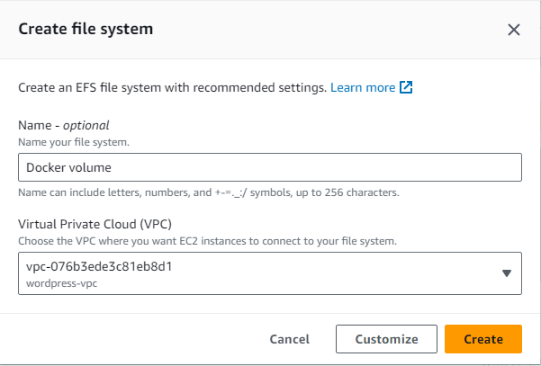

* Feito isso clique em "Customize".
* Coloque o tipo de File System "Regional".
* Na parte de Network Access, altere as opções de Mount Target e adicione o SG que criamos para o EFS nas duas Subnets privadas que criamos na VPC.

    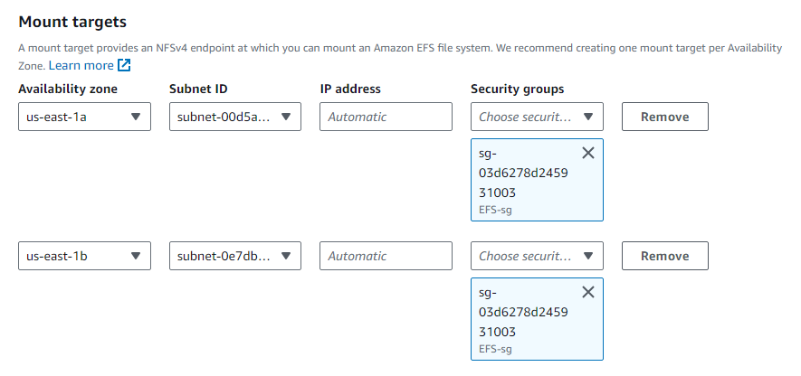
    
<em>Mount Targets do EFS</em>

---

### Criando Relational Database Service (RDS)

Para criar o RDS, basta ir até o serviço e clicar em "Create database".

Vamos Criar o RDS com as seguintes características:

* **Tipo de Engine**: MySQL
* **Versão da Engine**: 8.0.35
* **Template**: Free Tier
* **Configuração da Instância**: db.t3.micro
* **Armazenamento**: 
    * gp3
    * 20GB
* **Conectividade**:
    * **VPC**: <"Sua VPC">
    * **Public Access**: Não
    * **VPC Security Group**: RDS-sg (VPC que criamos em [Criando Security Group](#criando-security-group))
* **Autenticação**: Password authentication

Em Configurações Adicionais (Additional configuration), vá até "Nome inicial do banco de dados"(Initial database name) e coloque o nome que você desejar no banco de dados.

---

### Criando Launch Template

Agora iremos criar um Launch Template para futuramente criar um Auto Scalling Group.

##### Caracteristicas da instância:

* **AMI**: Amazon Linux 2023 AMI
* **Arquitetura**: 64-bit(x86)
* **Instance Type**: t3.small
* **Key Pair**: Seu Par de chaves (se não tiver clique em "Create new key pair")
* **Networking Settings**:
    * **VPC**: <"Sua VPC">
    * **Subnet**: Não colocar no Template
    * **Security Group**: Seu SG (criado em [Criando Security Group](#criando-security-group))
* **Armazenamento**: 20GB gp3
* **Detalhes Avançados**: Em detalhes avançados você irá até User data e adicionará o arquivo [user_data.sh](/user_data.sh) que se encontra neste repositório. Todo o código irá instalar o Docker, Docker Compose e o NFS e em sequencia irá fazer a montagem do EFS na intância e depois disso configurar o `docker-compose.yml` para criar o container e iniciá-lo.

### Criando Auto Scalling Group

1. **Nome do Auto Scalling Group**: <*NOME QUE VOCÊ DESEJAR*>
2. **Launch Template**: Escolha a que criamos
3. **Network**:

    

        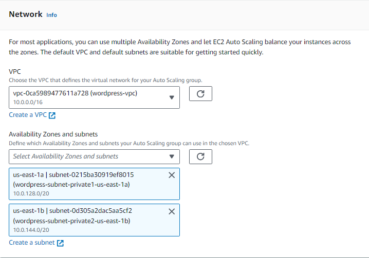
        
<em>Note-se que escolhemos a VPC que criamos e as Subnets que o Auto Scalling Group irá utilizar serão somente as privadas.</em>

    

4. **Load Balancer**: Iremos deixar sem Load Balancer no momento.
5. **Capacidade desejada do grupo**: 2
6. **Scalling limits**: Minimo: 2 | Maximo: 4
---

### Criando Classic Load Balancer

1. **Nome**: <*Nome que desejar*>
2. **Scheme**: Voltado para a internet
3. **VPC**: <*VPC que criamos*>
    * Em **Mapeamento** iremos escolher as duas AZ's da VPC e iremos escolher a subnet pública de cada AZ para que possamos acessar a instância.
        

            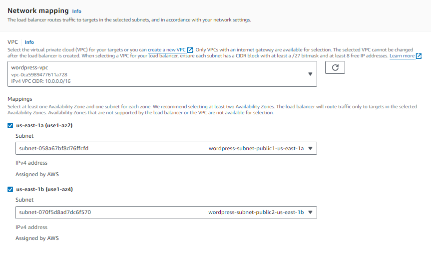
            
<em></em>

        

4. **Security Group**: <*Security Group que criamos para o LB*>
5. **Listener and Routing**:
        

            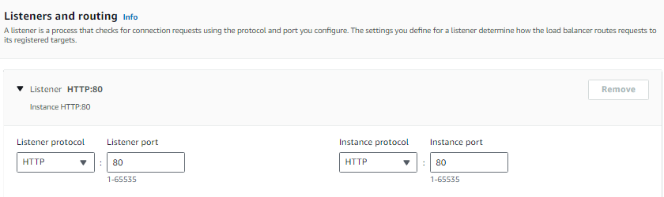
            
<em></em>

        

6. **Health Checks**: Seguir configuração da imagem abaixo.
        

            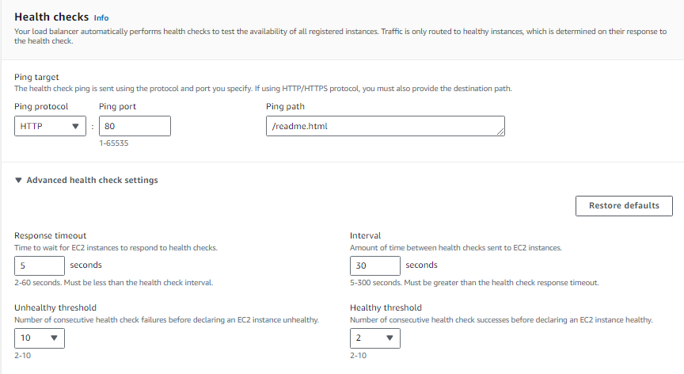
            
<em>Lembre-se que o Ping Path deverá ser o `/readme.html`</em>

        

7. **Instances**: Adicione as instâncias que o Auto Scalling Group criou.
---
#### Feito isso, vá até o Auto Scalling Group novamente e irá editá-lo.

    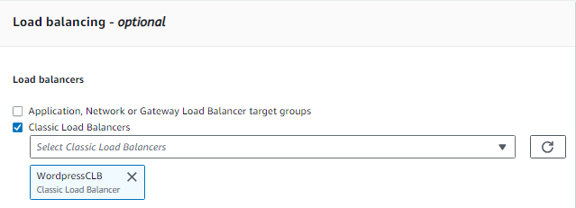
    
<em>Adicione seu Clasic Load Balancer no Auto Scalling Group.</em>

---
Para acessar o Wordpress, basta utilizar o DNS do Load Balancer.

    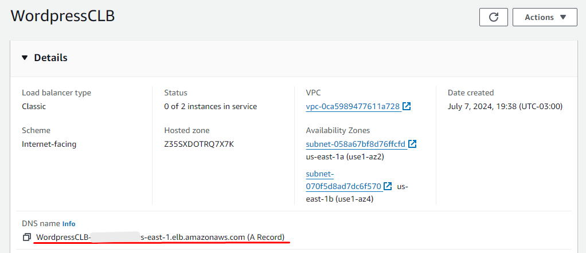
    
<em></em>

---